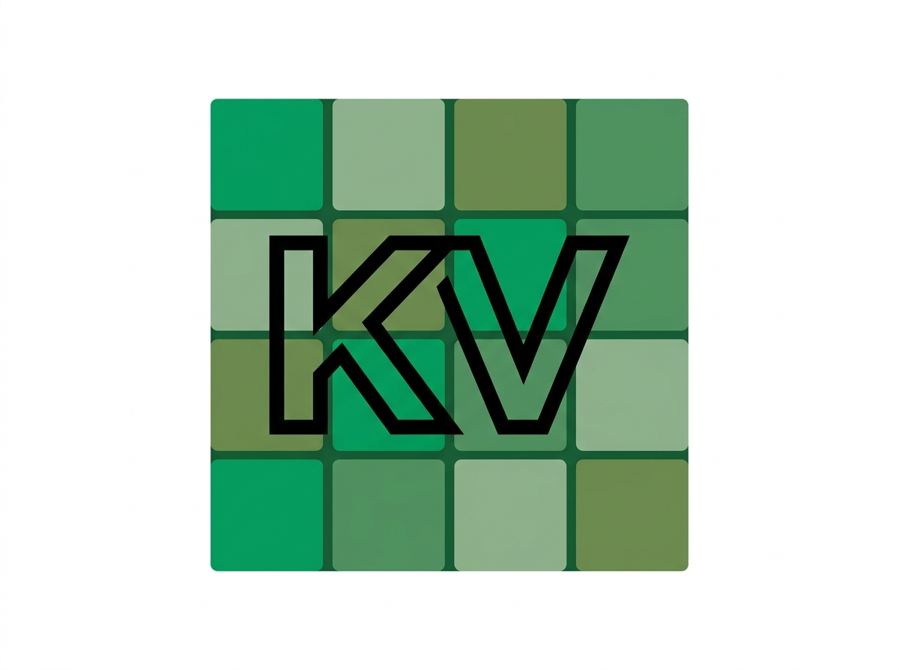

  

[](#contributors-)

# [](https://www.technologiestiftung-berlin.de/projekte/kiezlabor)

## About KiezVision

KiezVision is an interactive web application that helps people visualize greener, car-reduced, and more livable streetscapes in Berlin. Starting from real Mapillary street photography or uploaded images, users apply AI-powered transformations to explore urban futures — adding trees, benches, bike racks, pedestrian zones, and other interventions — then compare before and after, refine specific areas, and save results to a personal library.

KiezVision is an open source project by the [Technologiestiftung Berlin](https://www.technologiestiftung-berlin.de/) and [CityLAB Berlin](https://citylab-berlin.org/de/start/). It supports planning and participation contexts — workshops, internal coordination, and citizen engagement — where a concrete visual makes ideas easier to discuss and decide on.

## Website

KiezVision is part of the [Kiezlabor](https://www.technologiestiftung-berlin.de/projekte/kiezlabor) — a mobile participation lab by Technologiestiftung Berlin and CityLAB Berlin that tours Berlin’s districts with digital tools for urban co-creation.

- **Project:** [technologiestiftung-berlin.de/projekte/kiezlabor](https://www.technologiestiftung-berlin.de/projekte/kiezlabor)
- **Repository:** [github.com/technologiestiftung/KiezVision](https://github.com/technologiestiftung/KiezVision)

## Getting started

**Prerequisites:** Node.js 18 or later

```bash
git clone https://github.com/technologiestiftung/KiezVision.git
cd KiezVision
npm install
cp .env.example .env.local
```

Add your API keys to `.env.local` (see [Configuration](#configuration)), then start the dev server:

```bash
npm run dev
```

Open **http://localhost:3000/** in a Chromium-based browser (Chrome, Edge, Brave, Arc).

## Configuration

Create `.env.local` from [`.env.example`](.env.example):

| Variable | Required | Description |
| --- | --- | --- |
| `GEMINI_API_KEY` or `CUSTOM_GEMINI_API_KEY` | Yes | Google Gemini API key for image generation and location grounding |
| `MAPILLARY_ACCESS_TOKEN` | Recommended | Mapillary Graph API token for real street imagery |

If `MAPILLARY_ACCESS_TOKEN` is missing, street search cannot load Mapillary candidates and the app will surface an empty picker or error depending on context.

Keys are injected at build time through Vite `define` in [`vite.config.ts`](vite.config.ts). They are embedded in the client bundle — use restricted API keys and do not commit `.env.local`.

## Documentation

For architecture, technical pipelines, and how the app works under the hood, see [README_DEV.md](./README_DEV.md).

| Document | Description |
| --- | --- |
| [README_DEV.md](./README_DEV.md) | Architecture, app workflow, and technical pipelines |
| [docs/area-edit-backend.md](./docs/area-edit-backend.md) | Area edit (masked inpainting) API reference |

## Contributors ✨

Thanks goes to these wonderful people ([emoji key](https://allcontributors.org/docs/en/emoji-key)):

<!-- prettier-ignore-start -->
<!-- markdownlint-disable -->
<table>
  <tr>
    <td align="center"><a href="https://github.com/zainab-tariq"><br /><sub><b>Zainab Tariq</b></sub></a><br /><a href="https://github.com/technologiestiftung/KiezVision/commits?author=zainab-tariq" title="Code">💻</a></td>
    <td align="center"><a href="https://github.com/Engy-ai"><br /><sub><b>Engy El Shenawy</b></sub></a><br /><a href="https://github.com/technologiestiftung/KiezVision/commits?author=Engy-ai" title="Code">💻</a></td>
  </tr>
</table>
<!-- markdownlint-restore -->
<!-- prettier-ignore-end -->

This project follows the [all-contributors](https://github.com/all-contributors/all-contributors) specification. Contributions of any kind welcome!
